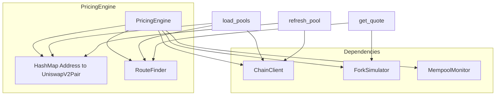

# peanut_task

A test task for getting into Peanut Trade.

## Requirements
- Rust 1.85+ (2024 edition required)
- [just](https://github.com/casey/just) command runner (install via `cargo install just` or your package manager)
- [rustup](https://rustup.rs/) recommended for managing toolchains & components (rust-analyzer, clippy, etc.)

## Installation

1. Clone the repository:
   ```bash
   git clone https://github.com/klucly/peanut_task.git
   cd peanut_task
   ```

2. Install `just` (if not already installed):
   - Arch Linux:
     ```bash
     sudo pacman -S just
     ```
   - Most systems (via Cargo):
     ```bash
     cargo install just
     ```
   - Homebrew (macOS):
     ```bash
     brew install just
     ```
   - Other options: see https://github.com/casey/just#installation

3. Install common Rust components (optional but recommended for development):
   ```bash
   rustup component add rust-src clippy rustfmt
   ```

4. Sync dependencies & build (creates `target/`):
   ```bash
   just install
   ```
   (Adds rustup components rust-src, clippy, rustfmt; fetches Cargo crates and builds — see Development Commands below)

## Setup .env

Copy `.env.example` to `.env`

## Run the Project

```bash
just run
```

(Or with arguments: `just run -- --verbose`)

## Example Output

Sample output from `just run` (price impact, best route, mempool monitoring):

```
═══════════════════════════════════════════════════════════════
  PRICE IMPACT TABLE (USDC/WETH pool)
═══════════════════════════════════════════════════════════════
USDC -> WETH  |  Pool 0xB4e16d0168e52d35CaCD2c6185b44281Ec28C9Dc
Reserves: 4156.136584991439381269 WETH / 9794685.605565 USDC

┌── USDC In ──┬─ WETH Out ──┬ Exec Price ─┬─ Impact ─┐
├─────────────┼─────────────┼─────────────┼──────────┤
│    1000     │    0.423    │   2364.01   │  0.31%   │
│    10000    │   4.2262    │   2366.17   │  0.40%   │
│   100000    │   41.8789   │   2387.83   │  1.30%   │
└─────────────┴─────────────┴─────────────┴──────────┘

Max trade for 1% impact: 69463.743998 USDC

═══════════════════════════════════════════════════════════════
  BEST ROUTE (USDC -> WETH)
═══════════════════════════════════════════════════════════════
Best route: USDC -> WETH (1 hops)
  Amount in: 10000 USDC
  Net output: 4.22622511379652212 (after gas)

═══════════════════════════════════════════════════════════════
  MEMPOOL MONITORING
═══════════════════════════════════════════════════════════════
Mempool monitor started. Listening for swap txs
(swapExactTokensForTokens, swapExactETHForTokens, swapExactTokensForETH)
Send test swaps to see them here. Running for 60 seconds...
```

## Limitations & Assumptions
- **Rust version**: Tested with stable 1.85+. Project uses 2024 edition; older toolchains will not work.
- **Error handling**: RPC failures trigger fallback across configured endpoints; some flows (e.g. send) deliberately exercise expected-error paths (e.g. unsupported transaction type). Not all error paths are fully surfaced to the user.
- **Platform**: Developed on Linux (Arch). Should work on macOS/Windows but shell commands in `justfile` or file paths / env vars may need minor tweaks.
- **dotenv**: Loads `.env` at runtime if present.

## Development Commands (just cheatsheet)

Run `just --list` to see all available commands with descriptions.

Common ones:

```bash
just install      # Install deps: rustup components + cargo build
just              # Runs the default pipeline: lint → build → test
just all          # lint + build + test + doc
just ci           # Same as CI would run (lint + build + test)
just run          # cargo run (with optional args: just run -- --help)
just test         # cargo test
just test-watch   # Watch mode for TDD (requires cargo-watch)
just lint         # cargo fmt --check + clippy
just fmt          # cargo fmt --all
just doc          # cargo doc --open
just clean        # cargo clean
just nextest      # cargo nextest run (if you add nextest)
```

**Running tests:** Many tests require a **running Anvil fork** and a **valid RPC URL**. Set `ETH_RPC_URL` or `INFURA_API_KEY` in `.env`, then run `just fork` in a separate terminal to start the fork before `just test`. Tests that need the fork (e.g. pricing engine, fork simulator, Uniswap pair) will skip or fail if the fork is not running.

## Pricing Module

The pricing module integrates AMM math, routing, fork simulation, and mempool monitoring into a unified interface.



### Example

```rust
use peanut_task::chain::{ChainClient, RpcUrl};
use peanut_task::core::base_types::{Address, Token};
use peanut_task::pricing::{Chain, PricingEngine};

// Create engine (requires fork URL; run `just fork` first)
let rpc = RpcUrl::new("{}", "http://127.0.0.1:8545")?;
let client = ChainClient::new(vec![rpc], 10, 1)?;
let mut engine = PricingEngine::new(
    client,
    "http://127.0.0.1:8545",
    "wss://mainnet.infura.io/ws/v3/YOUR_KEY",
    Chain::EthereumMainnet,
    None,
)?;

// Load pools and get a quote
let pair_addr = Address::from_string("0xB4e16d0168e52d35CaCD2c6185b44281Ec28C9Dc")?;
engine.load_pools(&[pair_addr])?;

let usdc = Token::new(6, Some("USDC".to_string()));
let weth = Token::native_eth();
let quote = engine.get_quote(&usdc, &weth, 1_000_000, 30, 3)?;

println!("Expected output: {}", quote.expected_output);
println!("Simulated output: {}", quote.simulated_output);
println!("Valid: {}", quote.is_valid());
```

Integration tests for the pricing engine require a running Anvil fork and valid RPC. Run `just fork` (with `ETH_RPC_URL` or `INFURA_API_KEY` in `.env`) before `cargo test` or `just test`.

